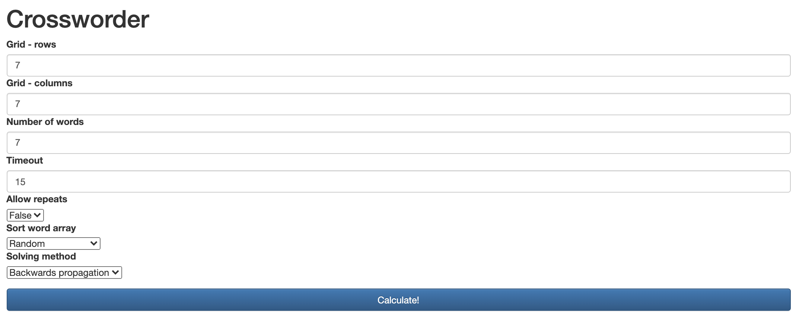
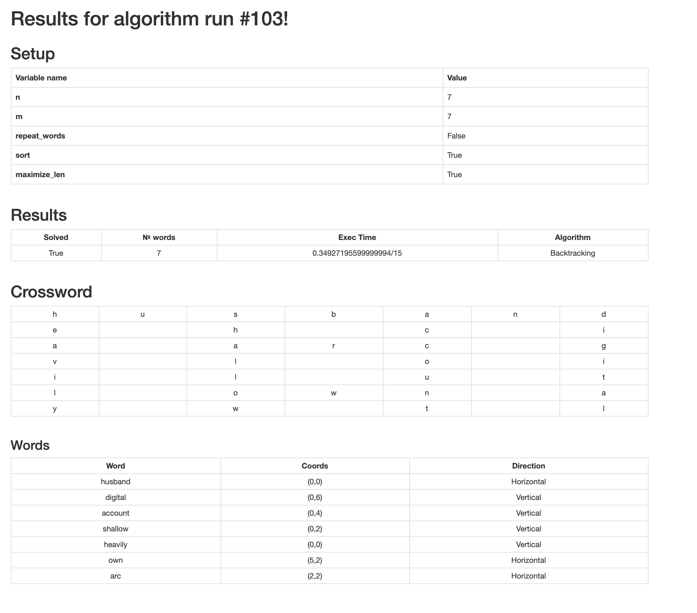

# Crossworder - a tool for creating crosswords in Python

## What and why

This is a project developed for an undergraduate course "Introduction to Artificial Intelligence" in Wrocław University of Science and Technology.

The task given to us was to make a program that would create crosswords by using two different methods - [backwards propagation](https://en.wikipedia.org/wiki/Backtracking) and [forward checking](https://en.wikipedia.org/wiki/Look-ahead_(backtracking)).

This application serves as a Flask server that gives you access to a console (`python3 run.py`,  http://127.0.0.1:5000/) that allows you to create crosswords if you provide the size of the grid, number of words to fit into the grid, the timeout for stopping if the crossword is too hard/impossible to calculate, and the solving method.

## Screenshots

 
Setting up the crossword 

 
Displaying the results

